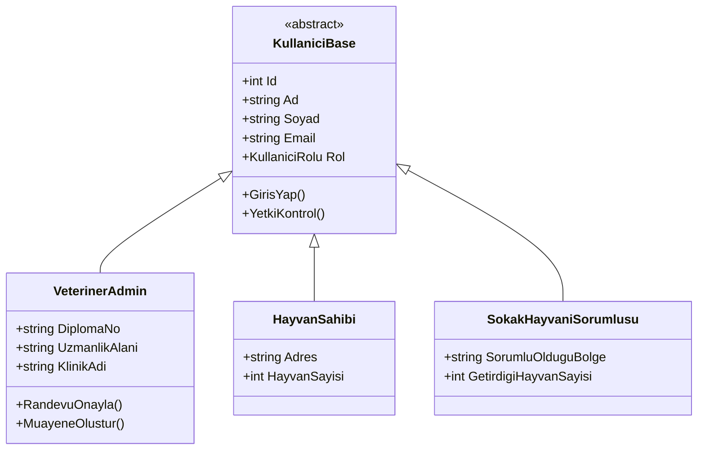
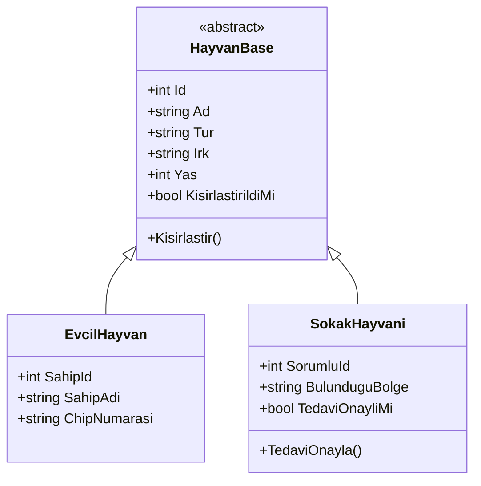

# Veteriner Klinik Yönetim Sistemi - Proje Özeti

## 📁 Proje Yapısı (Explorer Görünümü)

```
VeterinerProjectApp/
├── 📂 Enums/
│   ├── HayvanTuru.cs
│   ├── KullaniciRolu.cs
│   ├── RandevuDurumu.cs
│   └── SaglikDurumu.cs
├── 📂 Interfaces/
│   ├── IHayvan.cs
│   ├── IKullanici.cs
│   ├── IMuayene.cs
│   └── ITedavi.cs
├── 📂 Models/
│   ├── Asi.cs
│   ├── EvcilHayvan.cs
│   ├── Hastalik.cs
│   ├── HayvanBase.cs
│   ├── HayvanSahibi.cs
│   ├── KullaniciBase.cs
│   ├── Muayene.cs
│   ├── Randevu.cs
│   ├── SokakHayvani.cs
│   ├── SokakHayvaniSorumlusu.cs
│   ├── Tedavi.cs
│   └── VeterinerAdmin.cs
├── 📂 Services/
│   ├── BildirimServisi.cs
│   ├── OturumYoneticisi.cs
│   ├── VeriYoneticisi.cs
│   └── VeritabaniServisi.cs
├── 📄 Program.cs
├── 📄 FormLogin.cs (Giriş)
├── 📄 FormKayit.cs (Kayıt)
├── 📄 Form1.cs (Ana Menü)
├── 📄 Form2.cs (Klinik Yöneticisi Paneli)
├── 📄 Form3.cs (Pet Kullanıcısı Paneli)
├── 📄 Form4.cs (Patili Koruyucu Paneli)
├── 📄 Form5.cs (Hayvan Kayıt)
├── 📄 Form6.cs (Nöbetçi Klinik)
├── 📄 Form7.cs (Şikayet/Öneri)
├── 📄 Form8.cs (Panel)
├── 📄 Form9.cs (Randevu Onaylama)
├── 📄 Form10-15.cs (Diğer Formlar)
├── 📄 FormHastaGoruntule.cs
├── 📄 FormHastaGoruntuleSokak.cs
├── 📄 FormIslemKayit.cs
├── 📄 FormRapor.cs
├── 📄 FormBildirimler.cs
├── 📄 FormArama.cs
└── 📄 FormSikayetler.cs
```

---

## 👥 Kullanıcı Rolleri

| Rol | Açıklama | Yetkiler |
|-----|----------|----------|
| **Klinik Yöneticisi** | Veteriner/Admin | Tüm yetkiler, randevu onaylama, işlem kayıt |
| **Pet Kullanıcısı** | Hayvan Sahibi | Randevu alma, kendi hayvanlarını görme |
| **Patili Koruyucu** | Sokak Hayvanı Sorumlusu | Sokak hayvanı kaydı, sadece sokak hayvanlarını görme |

---

## 🖥️ Formlar ve İşlevleri

| Form | Dosya | İşlev |
|------|-------|-------|
| Giriş | `FormLogin.cs` | Kullanıcı girişi |
| Kayıt | `FormKayit.cs` | Yeni kullanıcı kaydı |
| Ana Menü | `Form1.cs` | Role göre yönlendirme |
| Admin Panel | `Form2.cs` | Klinik yöneticisi işlemleri |
| Pet Panel | `Form3.cs` | Hayvan sahibi işlemleri |
| Sorumlu Panel | `Form4.cs` | Patili koruyucu işlemleri |
| Hayvan Kayıt | `Form5.cs` | Yeni hayvan ekleme |
| Nöbetçi Klinik | `Form6.cs` | Günlük nöbetçi klinik arama |
| Randevu Al | `Form13.cs` | Randevu oluşturma (geliş sebebi seçimi) |
| Randevu Onay | `Form9.cs` | Bekleyen randevuları onaylama/reddetme |
| Hasta Görüntüle | `FormHastaGoruntule.cs` | Hayvan bilgilerini görme |
| İşlem Kayıt | `FormIslemKayit.cs` | Muayene/tedavi kaydetme |
| Raporlar | `FormRapor.cs` | İstatistik ve raporlar |
| Bildirimler | `FormBildirimler.cs` | Sistem bildirimleri |

---

## 📊 Veri Modelleri

| Model | Açıklama | Önemli Alanlar |
|-------|----------|----------------|
| `KullaniciBase` | Tüm kullanıcıların base sınıfı | Id, Ad, Soyad, Email, Sifre, Rol |
| `VeterinerAdmin` | Klinik yöneticisi | DiplomaNo, UzmanlikAlani, KlinikAdi |
| `HayvanSahibi` | Pet kullanıcısı | Adres, HayvanSayisi |
| `SokakHayvaniSorumlusu` | Patili koruyucu | SorumluOlduguBolge |
| `HayvanBase` | Tüm hayvanların base sınıfı | Id, Ad, Tur, Irk, Yas, Cinsiyet |
| `EvcilHayvan` | Sahipli hayvan | SahipId, ChipNumarasi |
| `SokakHayvani` | Sokak hayvanı | BulunduguBolge, TedaviOnayliMi |
| `Randevu` | Randevu kaydı | RandevuTarihi, RandevuNedeni, Durum |
| `Muayene` | Muayene kaydı | Tani, Tedavi, Ucret |
| `Asi` | Aşı kaydı | AsiAdi, SonrakiTarih |
| `Tedavi` | Tedavi kaydı | IlacBilgisi, Dozaj |

---

## ⚙️ Servisler

| Servis | Açıklama |
|--------|----------|
| `VeriYoneticisi` | Tüm verilerin yönetimi, JSON'a kaydetme/yükleme |
| `OturumYoneticisi` | Kullanıcı oturumu yönetimi |
| `VeritabaniServisi` | SQLite veritabanı işlemleri |
| `BildirimServisi` | Kullanıcı bildirimleri |

---

## 🔐 Giriş Bilgileri

| Rol | E-posta | Şifre |
|-----|---------|-------|
| Admin | `ceydakerem@posta.com` | `1234` |
| Kullanıcı | `ayse@email.com` | `user123` |
| Sorumlu | `mehmet@email.com` | `sorumlu123` |

---

## 🏗️ Class Yapısı (Kalıtım - Inheritance)





---

## 🔌 Interface Yapısı

| Interface | Açıklama | Metodlar |
|-----------|----------|----------|
| `IKullanici` | Kullanıcı arayüzü | `GirisYap()`, `CikisYap()`, `YetkiKontrol()` |
| `IHayvan` | Hayvan arayüzü | `BilgiGetir()`, `SaglikGuncelle()` |
| `IMuayene` | Muayene arayüzü | `MuayeneBaslat()`, `MuayeneBitir()` |
| `ITedavi` | Tedavi arayüzü | `TedaviUygula()`, `TedaviTamamla()` |

```csharp
// IKullanici Interface
public interface IKullanici
{
    int Id { get; set; }
    string Ad { get; set; }
    string Soyad { get; set; }
    string Email { get; set; }
    KullaniciRolu Rol { get; }
    bool GirisYap(string email, string sifre);
    void CikisYap();
    bool YetkiKontrol(string islemAdi);
}

// IHayvan Interface
public interface IHayvan
{
    int Id { get; set; }
    string Ad { get; set; }
    string Tur { get; set; }
    int Yas { get; set; }
    void BilgiGetir();
    void SaglikGuncelle(string durum);
}
```

---

## 📐 Enum Yapısı

| Enum | Değerler |
|------|----------|
| `KullaniciRolu` | VeterinerAdmin, HayvanSahibi, SokakHayvaniSorumlusu |
| `RandevuDurumu` | Bekliyor, Onaylandi, Reddedildi, Tamamlandi, IptalEdildi |
| `HayvanTuru` | Kedi, Kopek, Kus, Balik, Kemirgen, Diger |
| `SaglikDurumu` | Saglikli, Hafif, Orta, Agir, Kritik |

---

## 🆕 Son Eklenen Özellikler

1. ✅ **Nöbetçi Klinik Gün Seçimi** - İstenen güne göre nöbetçi klinik arama
2. ✅ **İşlem Kayıt Kontrolü** - Giriş yapmayan kullanıcılar için yönlendirme
3. ✅ **Kalıcı Veri Kaydetme** - Veriler JSON dosyasına kaydediliyor
4. ✅ **Geliş Sebebi Seçimi** - Randevu alırken sebep belirtme (Aşı, Muayene, Kısırlaştırma, vb.)
5. ✅ **Yönetici Görünümü** - Randevu onay ekranında geliş sebebi görüntüleme
6. ✅ **Sokak Hayvanı Filtresi** - Patili Koruyucu sadece sokak hayvanlarını görüyor
